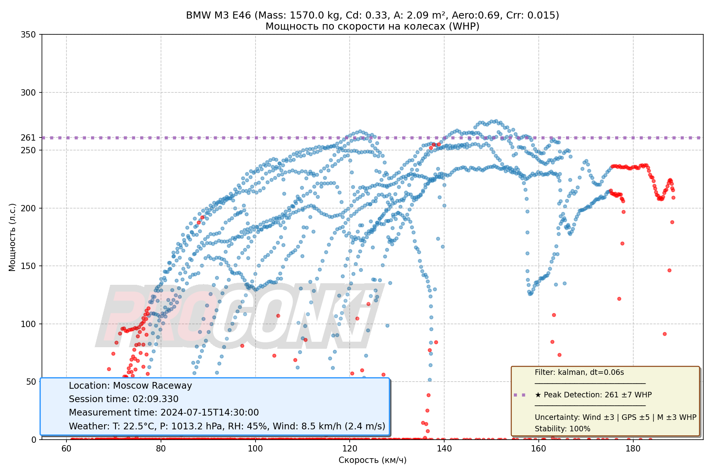
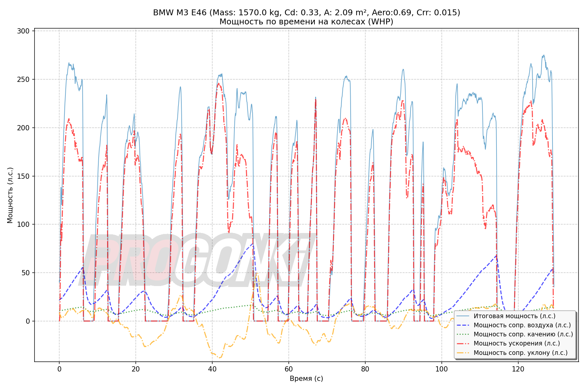
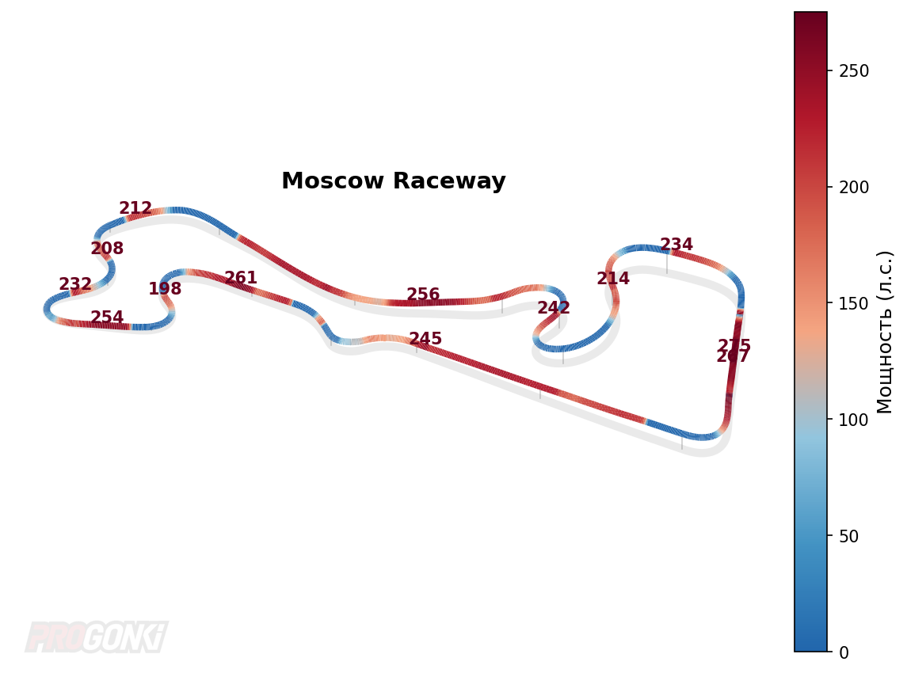

# GPSDyno


[](LICENSE)
[](https://www.python.org/)

**Калькулятор мощности на колёсах (WHP) по данным GPS**

[English documentation](README.md)

---

## Что такое GPSDyno?

GPSDyno рассчитывает мощность автомобиля на колёсах по GPS-данным в формате NMEA. Анализирует скорость, высоту и координаты, учитывая:

- Аэродинамическое сопротивление
- Сопротивление качению
- Уклон дороги

Идеально подходит для анализа заездов на разгон, записанных в RaceChrono или специализированных GPS-логгерах.

---

## Возможности

- **Двухпроходная адаптивная фильтрация Калмана** — убирает шум GPS, сохраняя динамику ускорения
- **5 статистических методов** оценки мощности (robust mean, перцентиль, KDE, детекция пиков, consistency)
- **Расчёт погрешности** — учитывает ветер, погрешность массы и качество GPS
- **Генерация графиков** — Мощность/Скорость, Мощность/Время, карта трека с тепловой картой
- **JSON-вывод** — удобная интеграция с другими инструментами

---

## Требования

- Python 3.8+
- ~100 МБ RAM для типичных NMEA файлов

### Зависимости

```
numpy
matplotlib
scipy
pynmea2
pillow
```

---

## Установка

```bash
git clone https://github.com/user/gpsdyno.git
cd gpsdyno
pip install -r requirements.txt
```

---

## Входные данные

### 1. NMEA файл (обязательно)

GPS-лог в стандартном формате NMEA 0183, содержащий:

| Сообщение | Данные |
|-----------|--------|
| `$GPRMC` | Скорость, координаты, время |
| `$GPGGA` | Высота, количество спутников, HDOP |

**Рекомендуемые настройки GPS:**
- Частота: **10 Гц** (минимум 5 Гц)
- Открытое небо для лучшего качества сигнала
- HDOP < 2.0

**Источники:**
- [RaceChrono](https://racechrono.com/) — экспорт в NMEA
- [Harry's LapTimer](https://www.gps-laptimer.de/) — экспорт в NMEA
- Автономные GPS-логгеры (u-blox и др.)

### 2. Параметры автомобиля (обязательно)

| Параметр | Описание | Пример |
|----------|----------|--------|
| `--mass` | Полная масса (авто + водитель + топливо) в кг | `1400` |
| `--drag_coefficient` | Коэффициент аэродинамического сопротивления (Cd) | `0.32` |
| `--frontal_area` | Лобовая площадь в м² | `2.1` |
| `--rolling_resistance` | Коэффициент сопротивления качению (Crr) | `0.015` |

### 3. Данные о погоде (опционально)

JSON файл с атмосферными условиями:

```json
{
  "temperature_c": 22.5,
  "pressure_hpa": 1013.2,
  "humidity_percent": 45,
  "wind_speed_kph": 8.5,
  "wind_direction_deg": 180,
  "location": "Название трека",
  "weather_datetime": "2024-07-15T14:30:00"
}
```

Если не указан, используются значения по умолчанию (20°C, 1013.25 гПа, 50% влажности, без ветра).

---

## Использование

### Базовая команда

```bash
python3 gpsdyno_calculator.py <nmea_файл> \
    --car 'Мой автомобиль' \
    --mass 1400 \
    --drag_coefficient 0.32 \
    --frontal_area 2.1 \
    --rolling_resistance 0.015
```

### Полная команда со всеми опциями

```bash
python3 gpsdyno_calculator.py data.nmea \
    --car 'BMW M3 E46' \
    --mass 1570 \
    --drag_coefficient 0.32 \
    --frontal_area 2.1 \
    --rolling_resistance 0.015 \
    --weather-json weather.json \
    --methods all \
    --output ./output/result
```

### Параметры командной строки

| Параметр | Описание | Обязательный |
|----------|----------|--------------|
| `nmea_file` | Путь к NMEA файлу | Да |
| `--car` | Название автомобиля (для графиков) | Нет |
| `--mass` | Масса в кг | Да |
| `--drag_coefficient` | Значение Cd | Да |
| `--frontal_area` | Лобовая площадь в м² | Да |
| `--rolling_resistance` | Значение Crr | Да |
| `--weather-json` | Путь к JSON файлу с погодой | Нет |
| `--methods` | Методы оценки мощности | Нет |
| `--output` | Путь для сохранения PNG графиков | Нет |

---

## Выходные данные

### JSON (stdout)

Результаты выводятся в формате JSON в stdout:

```json
{
  "success": true,
  "car_info": {
    "name": "BMW M3 E46",
    "mass": 1570.0,
    "drag_coefficient": 0.32,
    "frontal_area": 2.1,
    "rolling_resistance": 0.015
  },
  "results": {
    "power_estimation": {
      "methods": {
        "peak_detection": {
          "value": 288.1,
          "peak_count": 5
        }
      },
      "recommended": "peak_detection",
      "recommended_value": 288.1,
      "consistency_score": 0.95
    },
    "uncertainty": {
      "total_hp": 8.5,
      "range": [279.0, 296.0]
    }
  },
  "gps_frequency": 10.0,
  "session_info": {
    "duration_formatted": "00:45.000"
  }
}
```

### PNG графики (если указан `--output`)

| Файл | Содержимое |
|------|------------|
| `*_speed.png` | График Мощность/Скорость |
| `*_time.png` | График Мощность/Время |
| `*_track.png` | Карта трека с тепловой картой мощности |

### Примеры графиков

**Мощность / Скорость:**



**Мощность / Время:**



**Карта трека:**



---

## Методы оценки мощности

| Метод | Алиас | Описание |
|-------|-------|----------|
| `robust_mean` | `robust` | Усечённое среднее верхних 5% значений |
| `percentile_99` | `p99` | 99-й перцентиль мощности |
| `mode_kde` | `kde` | Мода через ядерную оценку плотности |
| `peak_detection` | `peak` | Медиана широких пиков **(по умолчанию)** |
| `consistency` | — | Стабильность по сегментам сессии |
| `all` | — | Запустить все методы |

Пример:
```bash
--methods robust_mean,p99,peak_detection
# или
--methods all
```

---

## Справочник параметров автомобилей

### Коэффициент аэродинамического сопротивления (Cd)

| Тип автомобиля | Диапазон Cd |
|----------------|-------------|
| Спорткупе (BRZ, GT86) | 0.27–0.30 |
| Седан (E36, E46, IS300) | 0.30–0.33 |
| Хэтчбек (Golf, Civic) | 0.31–0.35 |
| Кроссовер/SUV | 0.35–0.45 |
| Классические авто, ВАЗ | 0.38–0.50 |

### Лобовая площадь (м²)

| Тип автомобиля | Площадь |
|----------------|---------|
| Спорткупе | 1.9–2.0 |
| Компактный седан | 2.0–2.1 |
| Средний седан | 2.1–2.3 |
| Хэтчбек | 2.1–2.3 |
| Кроссовер/SUV | 2.5–3.0 |

---

## Советы для лучших результатов

1. **Используйте GPS более 10 Гц** — Низкая частота (1-5 Гц) значительно увеличивает погрешность
2. **Избегайте сильного ветра** — Ветер >30 км/ч вносит существенную ошибку
3. **Хороший GPS-сигнал** — Избегайте тоннелей, высотных зданий, густого леса
4. **Несколько заездов** — Повторные замеры помогают проверить результаты
5. **Точная масса** — Учитывайте водителя, топливо и груз

---

## Устранение неполадок

| Проблема | Решение |
|----------|---------|
| Большая погрешность | Проверьте частоту GPS, уменьшите влияние ветра |
| Предупреждение "All data filtered" | Качество GPS слишком низкое, попробуйте другое место |
| Нет данных о скорости | Убедитесь, что NMEA файл содержит сообщения $GPRMC |
| Нереалистичные значения мощности | Проверьте параметры автомобиля (масса, Cd, площадь) |

---

## Лицензия

Проект распространяется под лицензией [GNU Affero General Public License v3.0](LICENSE).

```
GPSDyno - GPS-based vehicle power calculator
Copyright (C) 2024 GPSDyno Contributors

This program is free software: you can redistribute it and/or modify
it under the terms of the GNU Affero General Public License as published by
the Free Software Foundation, either version 3 of the License, or
(at your option) any later version.
```

---

## Участие в разработке

Мы приветствуем вклад в проект! Создавайте issues и pull requests.
